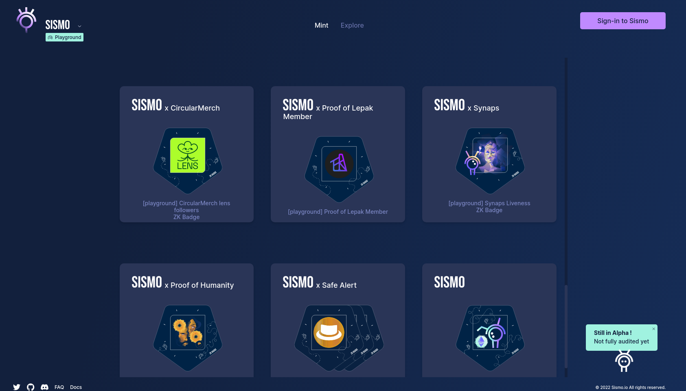
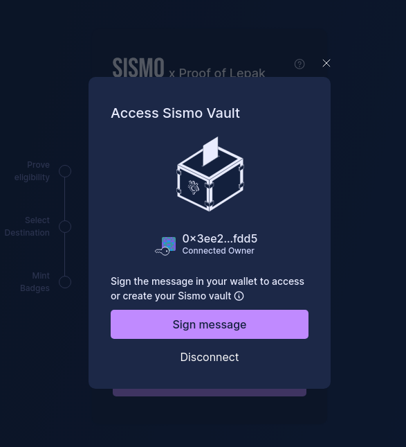
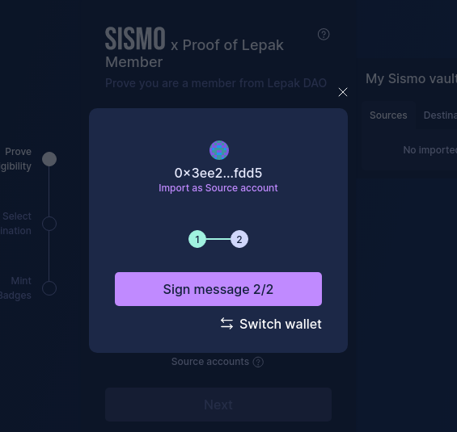
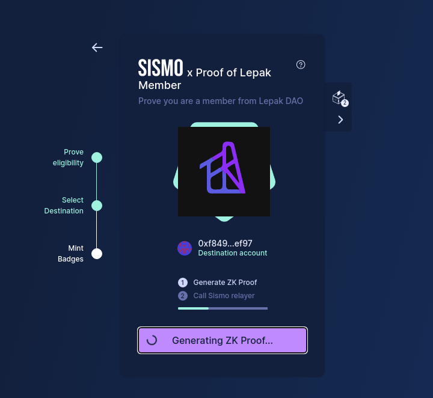
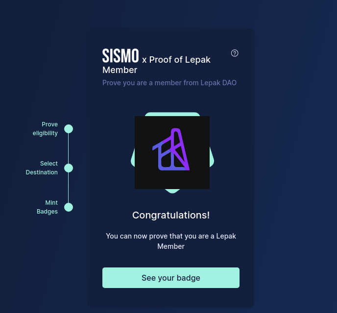
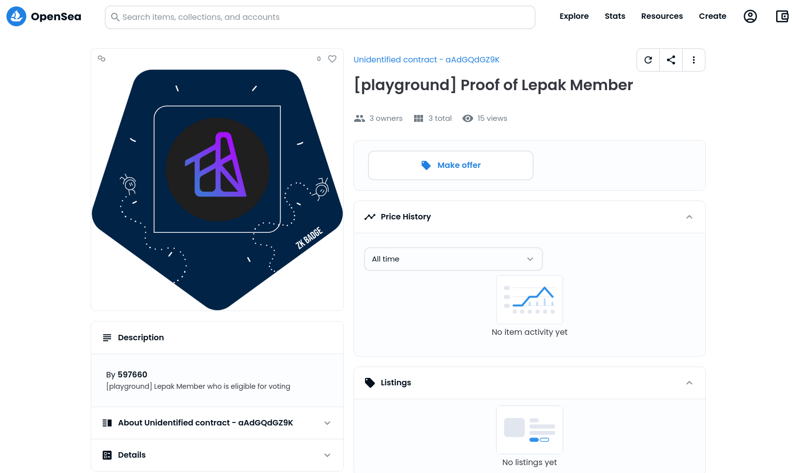
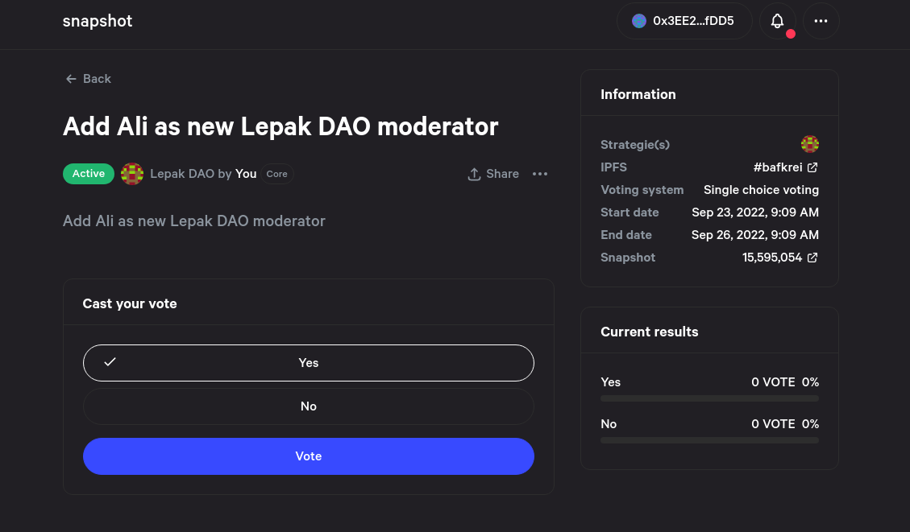

# SISMO - create zkBadge using zero knowledge

# Intro
## Why we use SISMO? 
The main purpose of using SISMO is to create a zkBadge for our Lepak DAO member for proof of eligibility for voting. Source address would be the member address of Lepak DAO, and the member can set the destination address, which is the address that accept zkBadge, by themselves. By using this zk-ness, the public will not able to know who actually votes for the proposal. Thus, enhance privacy for Lepak DAO member.

## How we use SISMO?
There are three part: **Data source computation**, **Group generation and compute attestation**, **Get your zkBadge and vote**

### Data source computation
We are using subgraph for listening to event emitted from polygon contract.


### Group generation and compute attestation
By using [sismo-hub](https://github.com/sismo-core/sismo-hub), we generate group from the previous step. Then compute attestation and send it on-chain for the attestor. In this way, attestor on L1 will have the group member data which enable it to verify request from users.

### Get your zkBadge and vote
Our member can now go to sismo-page and claim for their zkBadge. Once they have the badge, their address will be recorded in opensea and they are now eligible for voting!

# Resource and Guide
## Listen new Member event from Smart Contract
This will be the subgraph we are using for listening the event when a new member joining Lepak DAO.
### About this subgraph
1. Service: The Graph-Hosted Service
2. Subgraph Name: lepak-dao-member-2
3. Network: Matic (Polygon)
4. Queries(HTTP): https://api.thegraph.com/subgraphs/name/zengzengzenghuy/lepak-dao-member-2
5. Smart Contract Address: "0x086636172bAB74d87Ce89BE93660Ea105eC249B9"
6. Smart Contract Name: LepakCore.sol
7. Smart Contract Event: NewMember(address member,uint256 fee)

### Sample query
```
{
  members {
    id
    count
    member
    fee
  }
}
```

## Generate Group and compute attestation
All this part is done in [sismo-hub](https://github.com/sismo-core/sismo-hub) repo, check this [PR](https://github.com/sismo-core/sismo-hub/pull/117) for more details.

## Claim your LepakMember ZKBadge
Go to [SISMO playground](https://playground.sismo.io/proof-of-lepak-member) and start doing the claiming generation process.

### Step-by-Step
1. Click `Sign-in to Sismo` button and sign your metamask transaction. Remember to switch your network to **Polygon Mainnet**.

2. Import your source account and destination account. Switch your metamask account if you want to have different destination account, which is the recommended way and privacy-preserved way.   
- Source account: The account which is a member of Lepak DAO   
- Destination account: The account you want to mint the zkbadge for. *Boom! Now no one knows what is the mapping betwen source and destination account!*       
3. Click `Next` Button once you're eligible for minting the badge.
       

4. Click `Generating Zk Proof`. Now SISMO will generate the ZK Proof for you and Call Sismo relayer. This may take a few seconds. 

5. Once done, you can view your Lepak DAO ZKBadge on the [Badge Explorer](https://playground.sismo.io/explorer/search) or [OpenSea](https://opensea.io/assets/matic/0x71a7089C56DFf528f330Bc0116C0917cd05B51Fc/10000010)     
      
    

### Resource
1. SISMO playground: https://playground.sismo.io/proof-of-lepak-member
2. ZKBadge contract(Polygon mainnet): https://polygonscan.com/token/0x71a7089C56DFf528f330Bc0116C0917cd05B51Fc?a=10000010
3. OpenSea collection: https://opensea.io/assets/matic/0x71a7089C56DFf528f330Bc0116C0917cd05B51Fc/10000010
4. TokenID: 10000010


## Vote on Snapshot
Once you've claim your zkBadge, you can go to [Snapshot/LepakDAO](https://snapshot.org/#/lepakdao.eth) to vote for proposal.      
